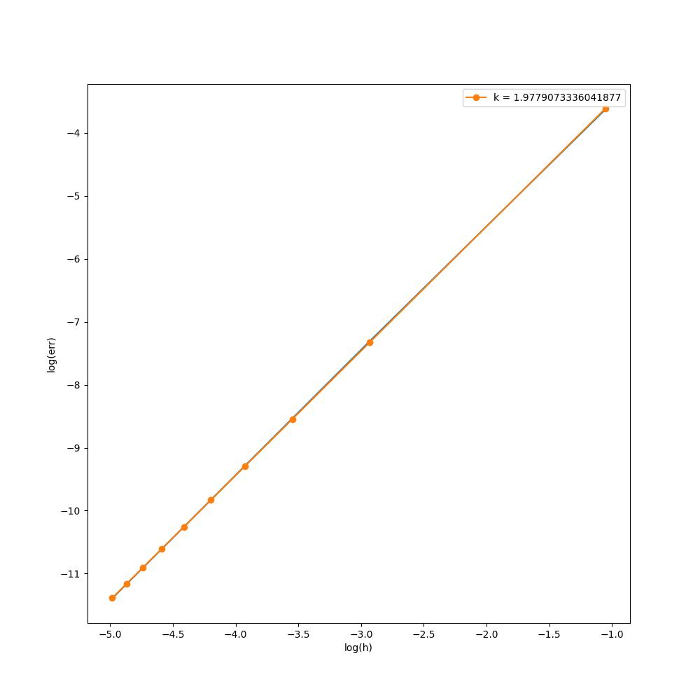

# Лабораторная работа 1. Задание 2
## Решаемая система:
$$
\begin{equation*} 
 \begin{cases}
   u_t = u_{xx} + tsin(2x) &\text{  0 < x < $\pi$,  ~~t > 0}\\
   u(x, 0) = 0 \\
   u(0, t) = u(\pi, t) = 0
 \end{cases}
\end{equation*}
$$
## Аналитическое решение:
$$u(x, t) = \frac{1}{16} (e^{-4t} + 4t-1)sin(2x)$$
## График:
