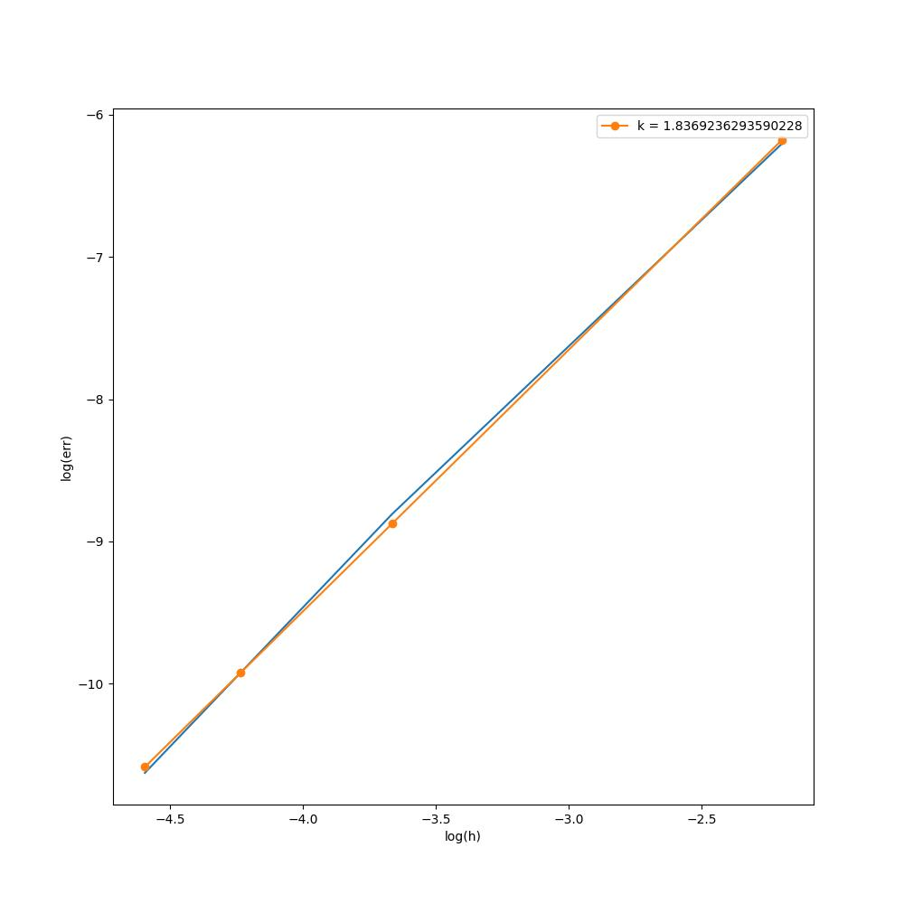

# Лабораторная работа 2. Задание 2
## Решаемая система:
$$
\begin{equation*} 
 \begin{cases}
   u_t = 25 \lambda u_{xx} + \lambda u_{yy}   &\text{  x, y $\in$ [0, 1],  ~~0 < t < 3}\\
   u(x, y, 0) = cos(\pi x)sin(5\pi y) \\
   u(x, 0, t) = u(x, 1, t) = 0 \\
   u(0, y, t) = sin(5 \pi y) e^{-50 \pi^2\lambda t} \\
   u(1, y, t) = -sin(5 \pi y) e^{-50 \pi^2\lambda t} \\

 \end{cases}
\end{equation*}
$$
## Приближенное аналитическое решение:
$$u(x, y, t) = cos(\pi x)sin(5\pi y) e^{-50 \pi^2\lambda t}\\$$
## График:
